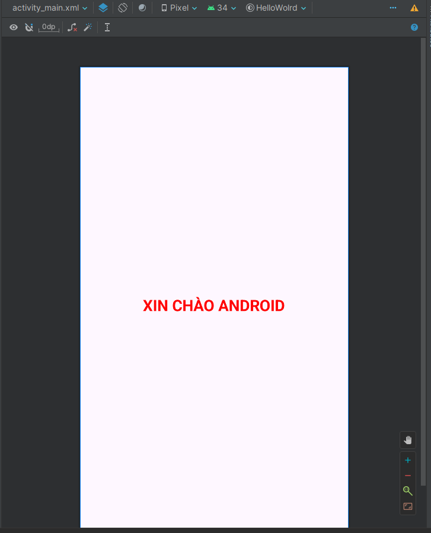

[![Contributors][contributors-shield]][contributors-url] ![languagecount][language-count-shield] ![license][license-shield] [![GitHub followers][followers-shield]][contributors-url]

 
<!-- Giới thiệu bản thân -->

    
     <h3 align="center">NGUYỄN THIẾT DUY ĐAN</h3>
     <h3 align="center" style="margin:0">63133615</h3>

<!-- Mục lục -->

  
Mục lục

  <ol style="font-size:15px;" >
    <li>
      <a href="#giới-thiệu-về-androidstudio">Giới thiệu về AndroidStudio</a>
      <ul>
        <li><a href="#android-studio">Android Studio</a></li>
        <li><a href="#một-số-đặc-điểm-của-android-studio">Một số điểm nổi bật về Android Studio</a></li>
      </ul>
    </li>
    <li>
        <a href="#các-bài-thực-hành-đặc-biệt">Các bài thực hành đặc biệt</a>
        <ul>
            <li><a href="#ex1_hello">Ex1_Hello</a></li>
            <li><a href="#ex2_linearlayout">Ex2_LinearLayout</a></li>
            <!-- <li><a href="#ex3_simplesumapp">Ex3_SimpleSumApp</a></li>
            <li><a href="#ex4_addsubmuldiv_onclick">Ex4_AddSubMulDiv_Onclick</a></li>
            <li><a href="#ex5_addsubmuldiv_anynomous">Ex5_AddSubMulDiv_Anynomous</a></li>
            <li><a href="#ex5_addsubmuldiv_var">Ex5+_AddSubMulDiv_Var</a></li> -->
        </ul>
    </li>
  </ol>

## Giới thiệu về AndroidStudio

### Android Studio

   Android Studio là một môi trường phát triển tích hợp (IDE) được phát triển bởi Google để phát triển ứng dụng di động chạy trên nền tảng Android. Nó là công cụ chính thức để phát triển ứng dụng Android và cung cấp một loạt các tính năng và công cụ để tạo, kiểm tra và triển khai ứng dụng Android một cách hiệu quả.

### Một số đặc điểm của Android Studio

    <ol>
        <li>Dựa trên IntelliJ IDEA: Android Studio được xây dựng dựa trên IntelliJ IDEA, một IDE phổ biến cho Java và nhiều ngôn ngữ lập trình khác. Điều này mang lại sự linh hoạt và hiệu suất cho nhà phát triển.</li>
        <li>Hỗ trợ ngôn ngữ Kotlin: Kotlin là một ngôn ngữ lập trình được Google chính thức hỗ trợ cho việc phát triển ứng dụng Android. Android Studio cung cấp tích hợp đầy đủ cho việc phát triển ứng dụng bằng Kotlin.</li>
        <li>Layout Editor: Android Studio có một trình soạn thảo giao diện người dùng mạnh mẽ giúp nhà phát triển thiết kế giao diện người dùng của ứng dụng một cách dễ dàng và nhanh chóng.</li>
        <li>Emulator: Android Studio đi kèm với một trình giả lập Android tích hợp, cho phép nhà phát triển kiểm tra ứng dụng của mình trên nhiều thiết bị Android ảo khác nhau.</li>
        <li>Debugging và Profiling: Android Studio cung cấp các công cụ mạnh mẽ để gỡ lỗi và phân tích hiệu suất của ứng dụng, giúp nhà phát triển tìm ra và sửa lỗi một cách dễ dàng.</li>
        <li>Quản lý phiên bản: Android Studio tích hợp với Git và hỗ trợ quản lý phiên bản thông qua hệ thống kiểm soát phiên bản, cho phép nhà phát triển làm việc một cách hiệu quả với nhóm.</li>
        <li>Cập nhật thường xuyên: Android Studio được cập nhật thường xuyên với các tính năng mới và sửa lỗi để đảm bảo rằng nhà phát triển có công cụ tốt nhất để phát triển ứng dụng Android.</li>
    </ol>

(<a href="#readme-top">Trở về trên đầu</a>)

## Các bài thực hành đặc biệt

### Ex1_Hello

Tạo máy ảo, chạy thử ứng dụng HelloWorld

<ol>
    <li>
        <b>Giao diện thiết kế trực quan</b> 
        
    </li>
    <li>
        <b>Giao diện thiết kế dựa vào viết code</b> 
        
    </li>
    <li>
        <b>Giao diện khi chạy trên máy ảo</b> 
        
    </li>
</ol>

(<a href="#readme-top">Trở về trên đầu</a>)

 

### Ex2_LinearLayout

Tạo ứng dụng thử nghiệm, demo bố cục màn hình Linear và ứng dụng tính tổng

<ol>
    <li>
        <b>Giao diện của phép tính cộng lúc ban đầu</b> 
        
    </li>
    <li>
        <b>Giao diện lúc nhập</b> 
        
    </li>
    <li>
        <b>Giao diện lúc hiển thị kết quả và ô kết quả không focus vào được</b> 
        
    </li>
</ol>

(<a href="#readme-top">Trở về trên đầu</a>)

 

### Ex3_SimpleSumApp

Ứng dụng tính tổng

- (1) Thiết kết màn hình: Sử dụng constrainstLayout
- (2) Xử lý backend: Bắt/Đáp ứng sự kiện bằng hàm xử lý cài đặt cho OnClick trên XML
  

<ol>
    <li>
        <b>Giao diện của phép tính cộng lúc ban đầu</b> 
        
    </li>
    <li>
        <b>Giao diện lúc nhập và hiển thị ra kết quả</b> 
        
    </li>
</ol>

(<a href="#readme-top">Trở về trên đầu</a>)

 

<!-- ### Ex4_AddSubMulDiv_Onclick

 

### Ex5_AddSubMulDiv_Anynomous

 

### Ex5+\_AddSubMulDiv_Var -->

 

## Other

    
[![Bootstrap][Bootstrap.com]][Bootstrap-url]

[contributors-shield]: https://img.shields.io/github/contributors/nguyenduydan/63133615_JavaProgramming?color=blue
[contributors-url]: https://github.com/nguyenduydan/63133615_JavaProgramming/graphs/contributors
[language-count-shield]: https://img.shields.io/github/languages/count/nguyenduydan/63133615_JavaProgramming?color=red
[license-shield]: https://img.shields.io/github/license/nguyenduydan/63133615_JavaProgramming
[followers-shield]: https://img.shields.io/github/followers/nguyenduydan?style=flat
[Bootstrap.com]: https://img.shields.io/badge/Bootstrap-563D7C?style=for-the-badge&logo=bootstrap&logoColor=white
[Bootstrap-url]: https://getbootstrap.com
